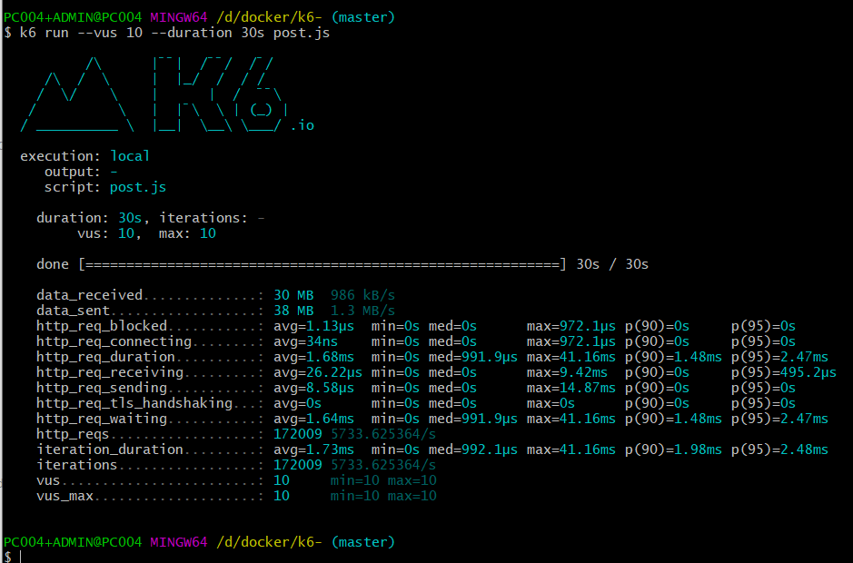

# k6工具简单的压力测试
### 官网: https://k6.io/


### 方法 1

- --vus 并发数
- --duration 执行时长(秒)
- --target 一共访问的数
- --post.js 执行的文件

并发10 访问30秒
```redshift
k6 run --vus 10 --duration 30s post.js
```
并发10 访问30次
```redshift
k6 run --vus 10 --duration 30 post.js
```
post.js
```js
import http from "k6/http"
const url = 'http://127.0.0.1:8080/pay/payList';//接口地址

export default function () {
	//数据参数
    var params = {
        "cmd": "user/giftRecv",
        "type": "6202",
        "username": "3595487",
        "vip": "4",
        "test":1
    };
	//head头参数
    var head = {"TOKEN":"04d844f425bcd51a304f1146614755ff","Content-Type":"application/json"};
	//发起请求
    var res = http.post(url,params , head);
	//控制台输出内容
   // console.log(res.body)
}
```


### 方法 2

```redshift
k6 run k6.js
```

代码内部控制并发数和时长
```js
import http from 'k6/http';
import { sleep } from 'k6';
export let options = {
  vus: 10, //并发数
  duration: '30s', //时长
};
export default function() {
  http.get('http://test.k6.io');
  sleep(1);
}

```

逐渐变化的并发测试
```js
import http from 'k6/http';
import { check, sleep } from 'k6';

export let options = {
  stages: [
    { duration: '30s', target: 20 },
    { duration: '1m30s', target: 10 },
    { duration: '20s', target: 0 },
  ],
};

export default function() {
  let res = http.get('https://httpbin.org/');
  check(res, { 'status was 200': r => r.status == 200 });
  sleep(1);
}
```





